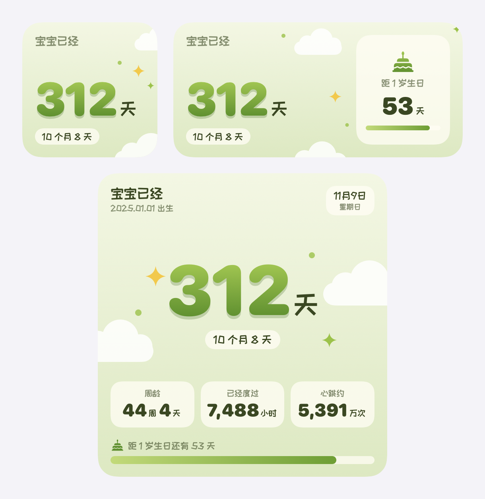
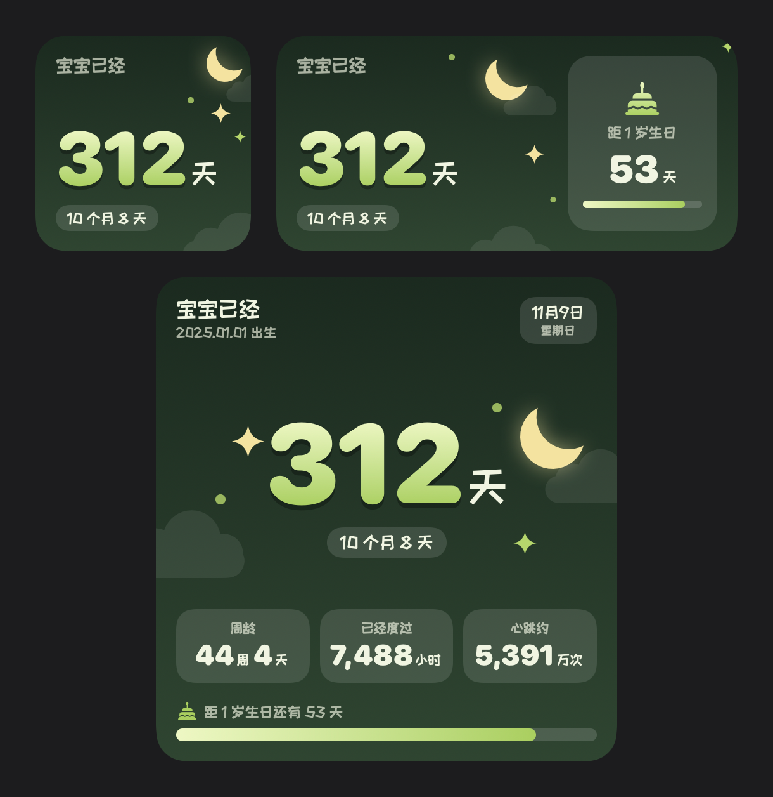
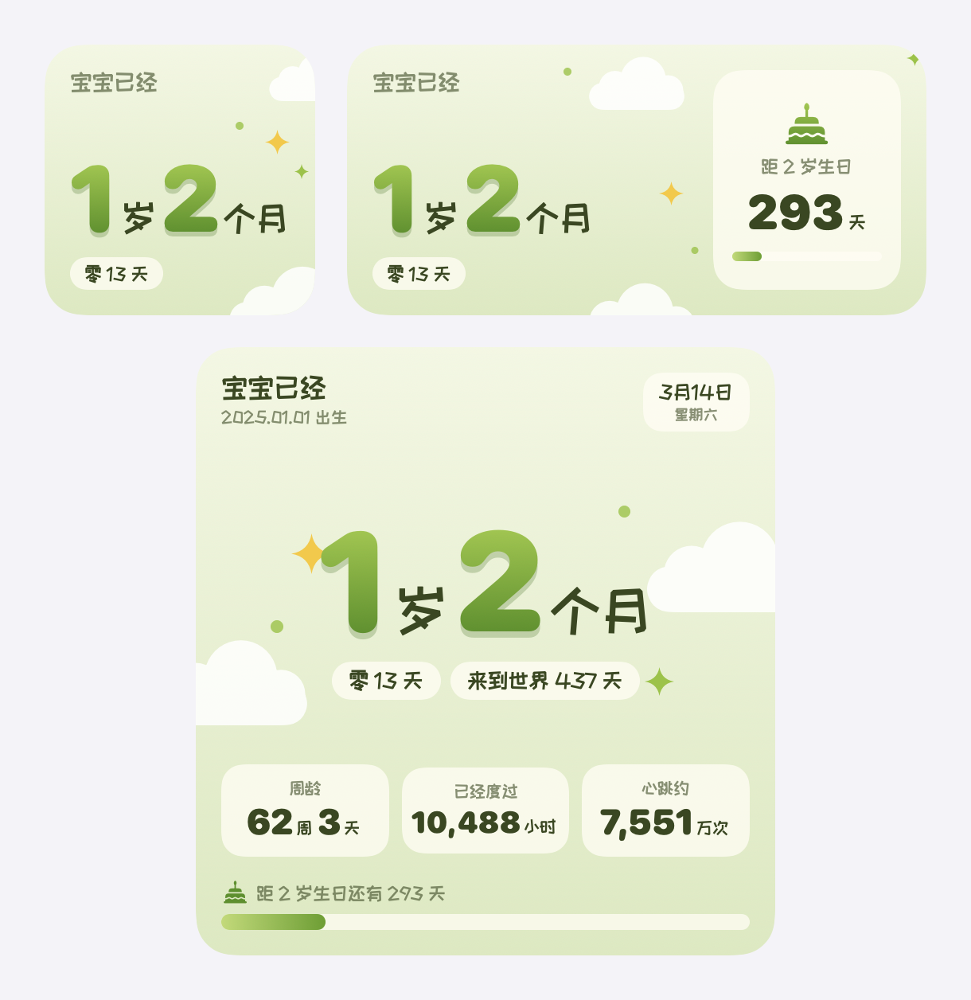
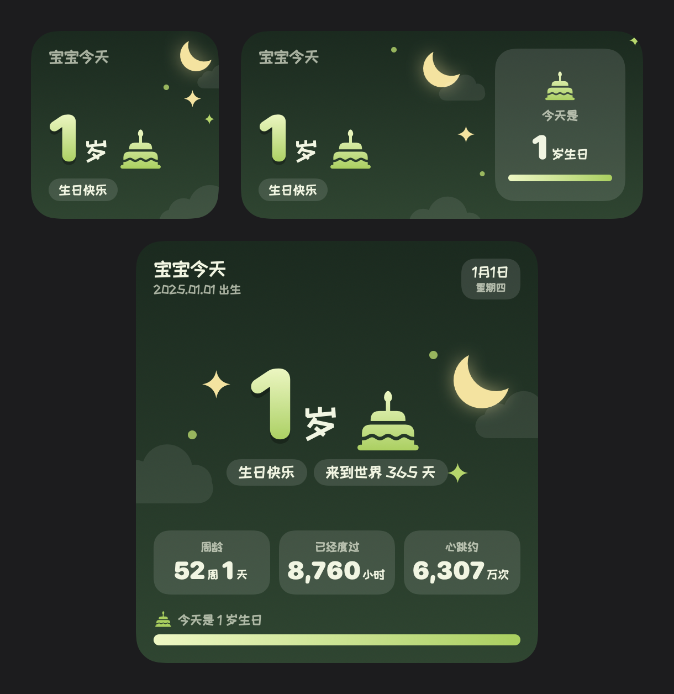

# 宝宝多大

宝宝多大是一组 iPhone 与 Mac 桌面小组件, 显示宝宝从出生至今的年龄, 以及距下一个生日的倒计时. 宝宝的生日在 App 中设置. 系统要求为 iOS 17 及以上与 macOS 14 及以上





## 安装到 Mac

在仓库根目录运行安装脚本. 本机装有 xcodegen 时, 脚本先重新生成工程, 然后构建 Release 版 macOS App. 构建成功后脚本安装到 /Applications/BabyDays.app 并打开 App, 构建失败时脚本输出错误后退出

```sh
scripts/install-mac.sh
```

首次打开 App 之后, 桌面的小组件库即可搜索到 "宝宝多大". 每次安装使用新的构建号, 桌面上已有的小组件随之刷新为新版画面

也可以从 [GitHub Releases](https://github.com/Caldis/baby-days/releases/latest) 下载公证后的 BabyDays-<版本号>.dmg, 打开后把 BabyDays 拖进 Applications

## 自动更新与发布

macOS 版内置 Sparkle 自动更新. App 每次打开时在后台检查新版本, 发现新版本后静默下载, 关闭 App 时完成安装. App 平时不运行时, 小组件每天检查一次更新清单, 有新版本时标题旁显示 "有新版本" (小号显示 "更新"), 点击小组件即打开 App 并弹出更新窗口. 菜单栏的 "检查更新…" 与 App 底部的 "检查更新" 按钮用于手动检查. iPhone 版以开发签名安装, 更新方式为重新用 Xcode 安装

发布新版本只需要一条命令. 脚本依次完成版本号更新与提交, Developer ID 签名, Apple 公证, 生成 Sparkle 更新清单, 推送代码与标签, 然后用 gh 创建 GitHub Release 并上传安装包. 更新说明默认取上一个标签之后的提交记录, 也可以作为第二个参数传入. 公证通常需要几分钟

```sh
scripts/release-mac.sh 1.2.0
scripts/release-mac.sh 1.2.0 "- 修正生日当天的文案"
```

发布前需要满足三个条件: 工作区没有未提交的改动; gh 已登录并对仓库有写权限; 更新包签名私钥位于 ~/.config/baby-days/sparkle_private_key. 私钥同时保存在登录钥匙串的 baby-days 账户中, 丢失后已安装的 App 无法再验证新版本, 请另行备份

## 安装到 iPhone

用 Xcode 打开 BabyDays.xcodeproj, 选择 BabyDays-iOS scheme 与连接的 iPhone, 然后运行. App 以开发签名安装到手机上. 付费开发者账号的开发描述文件有效期为一年, 到期后需要再用 Xcode 安装一次

Xcode 26 构建 iOS 产物时 (包括真机构建), actool 需要与 SDK 版本匹配的 iOS 模拟器运行时. 构建报错 No simulator runtime version ... available 时, 运行下面的命令下载 iOS 平台, 或在 Xcode 设置 → Components 中下载

```sh
xcodebuild -downloadPlatform iOS
```

## 放到桌面

小组件在系统小组件库中的名称为 "宝宝多大", 描述为 "看看宝宝今天多大啦". 打开 App 可以看到当天三种尺寸的预览与当前平台的添加步骤, App 每次回到前台时刷新全部小组件

### Mac

1. 右键点按桌面空白处, 选择 "编辑小组件"
2. 搜索 "宝宝多大"
3. 选择尺寸, 拖到桌面上

### iPhone

1. 长按主屏幕空白处, 点按左上角的 "编辑"
2. 选择 "添加小组件", 搜索 "宝宝多大"
3. 选择尺寸

## 显示内容

小组件提供小, 中, 大三种尺寸. 三种尺寸都以一个大号主数字表示年龄, 主数字下方的胶囊标签是补充说明, 两者连读成完整的年龄. 中号在右侧增加生日倒计时卡片. 大号在顶部增加出生日期与当天的日期星期徽章, 在底部增加三格趣味换算与生日倒计时进度条

三种尺寸共用同一套配色, 配色跟随系统外观. 配色取自布偶小蛇的嫩绿与奶白, 浅色模式下为浅绿的草地晴空, 深色模式下为墨绿的林间夜空. iOS 主屏幕选择着色或透明外观时, 以及 macOS 桌面小组件处于浅色化状态时, 小组件使用单色配色

### 未满周岁

主数字是出生至今的累计天数, 出生当天为 0. 例如出生 312 天时, 主数字为 "312 天", 补充说明为 "10 个月 8 天". 出生当天的补充说明为 "欢迎来到这个世界", 满月之前为 "距满月还有 N 天", 恰好满整月的那天为 "满 N 个月啦"

### 满周岁后

主数字改为岁数加月数, 例如 "1 岁 2 个月", 月数为 0 时只显示 "1 岁". 补充说明为剩余的天数, 与主数字连读成 "1 岁 2 个月零 13 天"; 剩余天数为 0 的日子, 补充说明改为 "来到世界 N 天". 大号在满周岁后另外显示一个 "来到世界 N 天" 胶囊, 记录累计天数



### 生日当天

标题从 "宝宝已经" 变为 "宝宝今天", 主数字旁出现蛋糕图标, 补充说明为 "生日快乐". 倒计时显示 "今天是 1 岁生日" 这样的文案, 进度条为满格



### 趣味换算与生日倒计时

大号底部的三格趣味换算从另一个角度表示年龄: "周龄" 为满周数与余下的天数, 例如 "44 周 4 天"; "已经度过" 为累计天数乘以 24 得到的小时数, 例如 "7,488 小时"; "心跳约" 按平均每分钟 120 次估算心跳总数, 例如 "5,391 万次", 超过 1 亿次后以亿为单位显示

三格下方的进度条表示当前这一岁已走过的比例. 进度条上方的倒计时平时显示 "距 1 岁生日还有 N 天", 生日前一天显示 "明天就 1 岁啦". 中号右侧的倒计时卡片显示同样的剩余天数与进度条

## 设置生日

首次打开 App 时, 页面中央是一张生日日历, 选好日期后点 "开始" 即可. 设置完成后, 标题下方的 "修改生日" 按钮用于修改. 生日只保存在本机, App 与小组件通过 App Group 共享. 尚未设置生日时, 小组件显示 "打开 App 设置宝宝的生日", 点击小组件即打开 App

## 分享给其他人

Mac 用户可以直接下载 [GitHub Releases](https://github.com/Caldis/baby-days/releases/latest) 中公证后的 DMG, 装好后同样享有自动更新. iPhone 版目前以开发签名安装, 只能装在自己的设备上; 分享给其他 iPhone 用户需要走 TestFlight 或 App Store, 这两条路径尚未配置

## 修改视觉

视觉代码集中在 Shared 目录. Shared/Theme.swift 定义配色与字体, Shared/WidgetViews.swift 定义三种尺寸的布局与装饰物位置, Shared/Decorations.swift 定义云, 星光与弯月的形状. 修改之后用离线渲染脚本出图检查, 脚本用 swiftc 编译 Shared 与 Tools/Render, 与小组件共用同一套视图代码

```sh
scripts/render.sh snapshots   # 6 个日期场景 × 3 套配色的检查图, 输出到 .build/snapshots
scripts/render.sh docs        # 重新生成本文档的配图, 输出到 docs/images
scripts/render.sh icon        # 重新生成 App 图标图层, 输出到 Resources/AppIcon.icon/Assets
```

离线渲染图与桌面上的实际效果在文字宽度上略有差异, 最终效果以系统自带的 WidgetKit Simulator 为准. 代码结构, 显示规则与已知问题的完整说明见 docs/design.md

## 字体许可

中文字体为站酷快乐体 ZCOOL KuaiLe, 使用 SIL Open Font License 授权, 许可证全文位于 Resources/Fonts/ZCOOLKuaiLe-OFL.txt. 数字使用系统字体 SF Rounded
