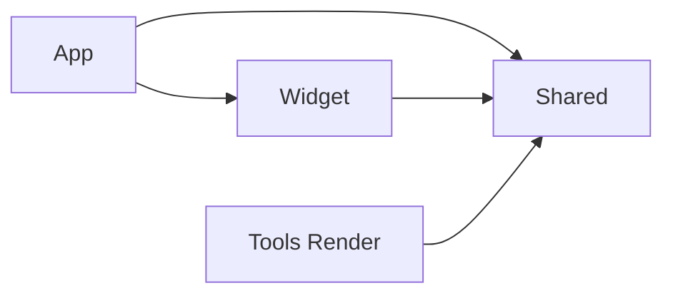

# 宝宝多大 设计文档

## 概览

宝宝多大 (工程名 BabyDays) 是一组 iOS 与 macOS 桌面小组件, 显示宝宝从出生至今的年龄与下一个生日的倒计时. 出生日期在 App 中设置, 保存在 App Group 共享的 UserDefaults 中, 小组件读取同一份数据. 系统要求为 iOS 17 及以上与 macOS 14 及以上

小组件使用 StaticConfiguration, kind 为 BabyDaysWidget, 名称为 "宝宝多大", 描述为 "看看宝宝今天多大啦", 支持 systemSmall, systemMedium, systemLarge 三种尺寸. App 的显示名在中文系统为 "宝宝多大", 其他语言为 "BabyDays", 两者分别写在 Resources/Localization 下 zh-Hans.lproj 与 en.lproj 的 InfoPlist.strings 中; macOS 的 Info.plist 另外声明 LSHasLocalizedDisplayName, Finder, 程序坞与启动台据此显示本地化名称. App 主界面 App/GalleryView.swift 显示标题, 出生日期, 当天三种尺寸的预览与 "放到桌面上" 三步说明, macOS 与 iOS 各有一套步骤文案. macOS App 启动时与 App 回到前台时调用 WidgetCenter.shared.reloadAllTimelines() 刷新全部小组件时间线, 更新安装后的首次启动因此清掉旧时间线中的 "有新版本" 提示

代码分为 App, Widget, Shared, Tools Render 四个部分. App, Widget 与 Tools Render 都依赖 Shared, App 另外依赖 Widget



图中箭头从依赖方指向所依赖的部分. App 与 Widget 在各自的 target 中编译 Shared 目录的源码, App target 依赖并内嵌小组件扩展. Tools/Render 是离线渲染工具, 位于 Xcode 工程之外, 只在 scripts/render.sh 中与 Shared 一起用 swiftc 编译

## 目录结构

仓库的工程定义源头是 XcodeGen 的 project.yml, 生成的 BabyDays.xcodeproj 一并提交. 源码与资源按职责分为 7 个目录, 其中 Shared 目录同时编译进 App 与小组件扩展

| 目录 | 内容 |
|---|---|
| App/ | App 入口 BabyDaysApp.swift, 主界面 GalleryView.swift, Info.plist, BabyDays.entitlements |
| Widget/ | 小组件入口与时间线 BabyDaysWidget.swift, Info.plist, BabyDaysWidget.entitlements |
| Shared/ | 年龄计算与文案 BabyAge.swift, 配色与字体 Theme.swift, 装饰图形 Decorations.swift, 小组件视图 WidgetViews.swift |
| Resources/ | Assets.xcassets (AccentColor, LaunchBackground), 图标 AppIcon.icon, 字体目录 Fonts |
| Tools/Render/ | 离线渲染工具 Render.swift, 图标图层 IconArtwork.swift, 铅笔风格小蛇 PencilSnake.swift |
| scripts/ | 离线渲染脚本 render.sh, macOS 构建安装脚本 install-mac.sh, macOS 发布脚本 release-mac.sh |
| docs/images/ | README 配图 |

显示逻辑集中在 BabyAge 与 WidgetViews.swift, 渲染模式的换算集中在小组件入口, 图标源文件集中在 Tools/Render 与 Resources/AppIcon.icon

| 修改内容 | 位置 |
|---|---|
| 出生日期的存储与读取 | Shared/BabyProfile.swift 的 BirthDate 与 BabyProfile |
| 生日设置界面 | App/GalleryView.swift 的 welcome, BirthdayForm 与 "修改生日" 按钮 |
| 标题, 主数字, 补充说明, 倒计时文案 | Shared/BabyAge.swift 的文案扩展 |
| 三种尺寸的布局与组件 | Shared/WidgetViews.swift 的 SmallLayout, MediumLayout, LargeLayout 及其组件 |
| 背景装饰物位置 | Shared/WidgetViews.swift 的 Decor.layout(for:) |
| 配色与字体 | Shared/Theme.swift 的 Palette 与 Font 扩展 |
| 云, 四角星, 弯月的形状 | Shared/Decorations.swift |
| 渲染模式到配色的换算 | Widget/BabyDaysWidget.swift 的 BabyDaysWidgetView |
| 时间线 | Widget/BabyDaysWidget.swift 的 AgeProvider |
| 图标 | Tools/Render/PencilSnake.swift, Tools/Render/IconArtwork.swift, Resources/AppIcon.icon/icon.json |
| 自动更新 | App/Updater.swift, Shared/UpdateFeed.swift, project.yml 的 UPDATE_FEED_URL 与 SPARKLE_PUBLIC_KEY |
| 离线渲染的日期场景与尺寸 | Tools/Render/Render.swift |

## 年龄计算与文案规则

BabyAge 是某一天的年龄快照. 计算使用公历与当前时区, 以自然日为单位. 初始化时取展示日的 0 点, 用 Calendar 求出生至展示日相差的年, 月, 日 (years, months, days) 与累计天数 totalDays, 出生当天 totalDays 为 0. 同一次初始化还算出距下一个生日的天数 daysUntilNextBirthday, 当前这一岁已走过的比例 yearProgress, 以及距满月的天数 daysUntilFullMonth

视图只读取 BabyAge 的计算属性, 全部文案都在 BabyAge 的文案扩展中生成. 文案分支取决于两个状态: isInfant 表示未满周岁, 即 years 为 0; isBirthday 表示满周岁后的生日当天, 即 years 大于 0 且 months 与 days 都为 0. 出生当天属于未满周岁的分支. 下表中 Y 表示当前岁数, N 表示对应的天数或月数

| 属性 | 显示位置 | 规则 |
|---|---|---|
| caption | 标题 | 生日当天为 "宝宝今天", 其余为 "宝宝已经" |
| heroSegments | 主数字与单位 | 未满周岁为累计天数加 "天", 例如出生 312 天时为 "312 天"; 满周岁后为 "Y 岁 M 个月", 月数为 0 时为 "Y 岁" |
| detail | 补充说明胶囊 | 规则见下一张表 |
| totalDaysNote | 大号满周岁后的额外胶囊 | "来到世界 N 天", N 为累计天数 |
| countdown | 大号底部倒计时 | 生日当天为 "今天是 Y 岁生日", 生日前一天为 "明天就 Y+1 岁啦", 其余为 "距 Y+1 岁生日还有 N 天" |
| countdownTitle, countdownValue, countdownUnit | 中号倒计时卡片 | 平时依次为 "距 Y+1 岁生日", 剩余天数, "天"; 生日当天依次为 "今天是", Y, "岁生日" |
| birthdayProgress | 进度条 | 当前这一岁已走过的比例, 生日当天为 1, 即满格 |
| weeks, weekRemainderDays, hoursText, heartbeats | 大号趣味换算 | 周龄为 totalDays 除以 7 的商与余数; 小时数为 totalDays 乘以 24, 带千位分隔符; 心跳按每分钟 120 次估算, 不足 1 亿次时以万次为单位, 达到 1 亿次后以亿次为单位并保留一位小数 |

detail 的条件按下表顺序依次判断, 取第一个满足的条件

| 阶段 | 条件 | 补充说明 |
|---|---|---|
| 未满周岁 | 出生当天 | 欢迎来到这个世界 |
| 未满周岁 | 满月之前 | 距满月还有 N 天 |
| 未满周岁 | 恰好满整月 | 满 N 个月啦 |
| 未满周岁 | 其余日子 | M 个月 D 天, 例如 "10 个月 8 天" |
| 满周岁后 | 生日当天 | 生日快乐 |
| 满周岁后 | 剩余天数为 0 | 来到世界 N 天 |
| 满周岁后 | 其余日子 | 零 D 天, 与主数字连读成 "1 岁 2 个月零 13 天" |

大号在满周岁后显示 totalDaysNote 胶囊. 在 detail 同为 "来到世界 N 天" 的日子, 大号只显示 detail 这一个胶囊. 三种尺寸, App 预览与离线渲染读取同一组属性, 修改文案只改动 BabyAge 中的对应属性

## 三种尺寸布局

Shared/WidgetViews.swift 中的 BabyWidgetContent 按 WidgetSize 选择 SmallLayout, MediumLayout 或 LargeLayout. WidgetSize 的 small, medium, large 与 systemSmall, systemMedium, systemLarge 一一对应. 布局只负责前景内容, 背景是单独的 SkyBackground 视图, 在小组件中作为 containerBackground 使用

| 尺寸 | 布局 | 内容 |
|---|---|---|
| 小 | SmallLayout | 标题, 主数字 HeroNumber, 补充说明胶囊 Chip |
| 中 | MediumLayout | 左侧与小号相同; 右侧为 118 pt 宽的生日倒计时卡片 BirthdayCard, 含蛋糕图标, 剩余天数与进度条 |
| 大 | LargeLayout | 顶部为标题, 出生日期与右上角的日期星期徽章 DateBadge; 中部为主数字与补充说明, 满周岁后多一个 totalDaysNote 胶囊; 底部为趣味换算 FunFacts 与生日倒计时 BirthdayProgress |

HeroNumber 用 SF Rounded Black 渲染数字, 数字填充为纵向渐变, 单位使用中文字体. 生日当天 HeroNumber 在数字右侧追加 birthday.cake.fill 蛋糕图标. 进度条统一使用 ProgressTrack, BirthdayCard 与 BirthdayProgress 共用同一个 birthdayProgress 比例

FunFacts 是三格等宽卡片, 标题依次为 "周龄", "已经度过", "心跳约", 数值使用 SF Rounded, 单位使用中文字体. 周龄在余下天数为 0 时只显示周数. 三格的数值都随 totalDays 变化, 与主数字共用每天 0 点的刷新节奏

SkyBackground 先绘制渐变天空, 再按 Decor.layout(for:) 摆放装饰物. 每个尺寸有独立的装饰物列表, 坐标 x, y 为容器宽高的比例, size 为容器短边的比例, 云朵的高度为宽度的一半. 装饰物的 time 字段取 always, day 或 night: day 类出现在白天与单色配色下, night 类只出现在夜晚配色下. 白天配色因此显示白云与星光, 夜晚配色显示弯月, 星星与另一组位置的云

App 预览与离线渲染使用 WidgetCard 模拟小组件外观. WidgetCard 给内容加 16 pt 边距, 以 SkyBackground 为背景, 裁成 24 pt 圆角矩形, 默认尺寸为 430 pt 宽 iPhone (Plus 与 Pro Max) 的 170×170, 364×170 与 364×382. 小组件与 App 界面只包含数字, 文案, 图标与装饰图形, 布偶小蛇只出现在 App 图标上

## 配色与渲染模式

配色定义在 Shared/Theme.swift 的 Palette 中, 共 day, night, mono 三套. Shared 目录中的视图只从 Environment 的 palette 读取颜色, 渲染模式的换算集中在入口. 小组件入口 BabyDaysWidgetView 读取 widgetRenderingMode, showsWidgetContainerBackground 与 colorScheme, 选定配色后注入 Environment. App 主界面按系统外观注入 Palette.for(colorScheme), 离线渲染工具直接指定配色. Environment 中 palette 的默认值为 Palette.day

BabyDaysWidgetView 依次按渲染模式, 背景显示状态, 系统外观选定配色

| 配色 | 触发条件 | 外观 |
|---|---|---|
| mono 单色 | widgetRenderingMode 为 fullColor 以外的值, 对应 iOS 主屏幕着色或透明外观, 以及 macOS 桌面小组件的浅色化 (vibrant) 状态 | 背景透明, 内容为白色, 只保留透明度层次 |
| night 夜晚 | fullColor 且 showsWidgetContainerBackground 为 false, 例如 iOS StandBy; 或 fullColor 且 colorScheme 为 dark | 墨绿渐变, 弯月, 星星; 背景移除时内容直接落在黑底上 |
| day 白天 | fullColor, 显示背景, colorScheme 为 light | 奶白到浅绿渐变, 白云, 星光, 主数字为嫩绿到草绿渐变 |

主数字, 蛋糕图标与进度条填充都标记了 widgetAccentable, 系统着色时归入强调色分组

## 图形与字体

云 (Cloud), 四角星 (Twinkle), 弯月 (Crescent) 是 Shared/Decorations.swift 中的 SwiftUI Shape, 矢量绘制. 蛋糕图标使用 SF Symbols 的 birthday.cake.fill. 中文使用站酷快乐体 ZCOOL KuaiLe, 对应 Font.cute, 以固定字号渲染; 数字使用系统 SF Rounded Black, 对应 Font.hero

字体文件为 Resources/Fonts/ZCOOLKuaiLe-Regular.ttf, 大小 1.5 MB, 使用 SIL OFL 许可, 许可证文本位于 Resources/Fonts/ZCOOLKuaiLe-OFL.txt. App 与小组件扩展各打包一份字体文件, 两者的 Info.plist 同时声明 UIAppFonts (iOS) 与 ATSApplicationFontsPath (macOS) 完成注册

## 时间线

Widget/BabyDaysWidget.swift 中的 AgeProvider 提供时间线. getTimeline 一次生成 8 条记录: 第一条为当前时刻, 其后 7 条依次为未来 7 天的 0 点, 0 点按 BabyAge.calendar 的当前时区计算. 刷新策略为 atEnd, 最后一条记录生效后系统重新请求时间线. placeholder 与 getSnapshot 都返回当前时刻的记录

AgeEntry 只保存日期, 读取 age 属性时按该日期计算 BabyAge, 视图拿到的年龄与记录日期一一对应. App 回到前台时的 reloadAllTimelines() 是时间线之外的另一条刷新途径

## 图标流水线

App 图标使用 Xcode 26 Icon Composer 格式, 源文件为 Resources/AppIcon.icon 文件包. 文件包中的 icon.json 定义底色与图层, Assets 目录存放 2 个 1024×1024 的透明 PNG 图层. 底色为纸张米白 (#FBF7EA), 深色外观为略暗的米色 (#E1DCC9), 图层均关闭 Liquid Glass 的玻璃与半透明效果, 保留彩铅质感

| 图层 | 文件 | 层级 | 深色外观 |
|---|---|---|---|
| Snake | Assets/snake.png | 前景, 带 0.25 中性阴影 | 与浅色外观相同 |
| Paper | Assets/paper.png | 背景, 纸张颗粒与纤维 | 与浅色外观相同 |

图标主体是彩色铅笔风格的布偶小蛇, 绘制代码位于 Tools/Render/PencilSnake.swift, 使用 Core Graphics 逐笔绘制. 轮廓由多遍带低频抖动的描线构成; 填色由淡色打底, 断续的平行排线, 背光侧的交叉排线三层叠加; 布偶质感来自形状内随机分布的小线圈与沿轮廓向外的短毛. 随机数使用固定种子, 每次渲染结果一致. 修改后执行下面的命令重新生成图层, 再执行 scripts/render.sh docs 更新 docs/images/icon.png

```sh
scripts/render.sh icon
```

Xcode 构建时, actool 从 .icon 生成 iOS 26 与 macOS 26 的 Liquid Glass 图标, 同时为旧系统生成回退图标, macOS 的回退图标为 AppIcon.icns. 在 macOS 26.1 上, 系统以标准圆角矩形显示该图标

工程配置中有两处与 .icon 相关. project.yml 在 options.fileTypes 中为 icon 扩展名设置 file: true, XcodeGen 随之以单个资源处理 .icon 文件包 (XcodeGen issue #1556). App 模板在 resources 构建阶段引入 Resources/AppIcon.icon, 并设置 ASSETCATALOG_COMPILER_APPICON_NAME 为 AppIcon

## 构建与签名

工程定义源头是 project.yml. 修改 project.yml 后执行下面的命令重新生成 BabyDays.xcodeproj, 并与 project.yml 一同提交

```sh
xcodegen generate
```

工程包含 4 个 target. targetTemplates 中的 App 与 Widget 两个模板承载共用的源文件与构建设置, 各 target 只声明平台与平台专属的设置

| target | 类型 | 平台 | Bundle ID |
|---|---|---|---|
| BabyDays-iOS | App | iOS | com.caldis.babydays |
| BabyDays-macOS | App | macOS | com.caldis.babydays |
| BabyDaysWidget-iOS | 小组件扩展 | iOS | com.caldis.babydays.widget |
| BabyDaysWidget-macOS | 小组件扩展 | macOS | com.caldis.babydays.widget |

签名方式为自动签名, 开发团队为 N7Z52F27XK. macOS 的两个 target 开启 App Sandbox 与 Hardened Runtime, 权限文件分别为 App/BabyDays.entitlements 与 Widget/BabyDaysWidget.entitlements

上述签名配置下, macOS 的安装使用 scripts/install-mac.sh 完成. 脚本在装有 xcodegen 时先生成工程, 然后以 Release 配置构建 BabyDays-macOS scheme, 构建号取当前时间 (年月日时分), 产物位于 ~/Library/Caches/baby-days/DerivedData. 构建失败时脚本输出错误并退出. 构建成功时脚本退出正在运行的 BabyDays, 替换 /Applications/BabyDays.app, 注销并删除构建目录中的 App 副本, 然后打开 App, 首次打开后桌面小组件库即可搜索到 "宝宝多大"

发布使用 scripts/release-mac.sh <版本号> [更新说明], 流程见自动更新一节

iPhone 安装使用 Xcode: 打开 BabyDays.xcodeproj, 选择 BabyDays-iOS scheme 与连接的 iPhone, 然后运行. 真机使用开发签名, 付费开发者账号的开发描述文件有效期为一年, 到期后需要重新用 Xcode 安装一次. Xcode 26 的 iOS 构建依赖模拟器运行时, 处理方式见已知问题一节. 已验证的构建环境为 macOS 26.1 与 Xcode 26.3, iOS 模拟器为 iOS 26.3 与 iPhone 17 Pro

## 出生日期设置

出生日期使用 Shared/BabyProfile.swift 中的 BirthDate 表示, 只保存公历年月日, 存储值为 "2025-01-01" 形式的字符串, 与时区无关. BabyProfile.birthDate 读写 App Group 中 UserDefaults 的 birthDate 键, App Group 标识取自 Info.plist 的 BabyDaysAppGroup, 该值来自 project.yml 中各 target 的 APP_GROUP_ID

| 平台 | APP_GROUP_ID | 权限文件 |
|---|---|---|
| iOS | group.com.caldis.babydays | App/BabyDays-iOS.entitlements, Widget/BabyDaysWidget-iOS.entitlements |
| macOS | N7Z52F27XK.com.caldis.babydays | App/BabyDays.entitlements, Widget/BabyDaysWidget.entitlements |

macOS 使用团队 ID 前缀的 App Group, 代码签名本身即可授权访问, 无需描述文件; iOS 的 App Group 由 Xcode 自动签名在开发者账号中注册

GalleryView 用 @AppStorage 绑定同一个键. 未设置生日时显示欢迎页与 BirthdayForm (图形日历, 日期上限为当天); 设置后显示预览, 标题下方的 "修改生日" 按钮以 sheet 形式打开同一个 BirthdayForm. 保存后调用 WidgetCenter.shared.reloadAllTimelines()

小组件的 AgeEntry.birth 为可选值. getTimeline 每次读取 BabyProfile.birthDate, 未设置时 BabyDaysWidgetView 显示 SetupPrompt ("打开 App 设置宝宝的生日"). placeholder 与小组件库预览 (getSnapshot) 在未设置时使用 BirthDate.sample(), 即当天往前 312 天

## 自动更新

macOS App 集成 Sparkle 2 (Swift Package, 版本 2.10.0 起), 只链接到 BabyDays-macOS target. 更新清单与安装包托管在公开仓库 Caldis/baby-days 的 GitHub Releases

| 组件 | 位置 | 作用 |
|---|---|---|
| Updater | App/Updater.swift | 创建 SPUStandardUpdaterController; App 启动后调用 checkForUpdatesInBackground; 提供菜单 "检查更新…" 与 App 底部按钮使用的 checkForUpdates |
| AppDelegate | App/Updater.swift | 关闭最后一个窗口时退出 App, Sparkle 在退出时安装已下载的更新 |
| UpdateFeed | Shared/UpdateFeed.swift | 小组件读取更新清单, 比较清单中最大的 sparkle:version 与自身的 CFBundleVersion |
| UpdateBadge | Shared/WidgetViews.swift | 环境值 updateAvailable 为 true 时显示 "有新版本", 小号显示 "更新"; 小组件同时设置 widgetURL 为 babydays://update |
| onOpenURL | App/GalleryView.swift | 收到 babydays://update 时调用 checkForUpdates 弹出更新窗口 |

更新相关的配置集中在 project.yml 与 Info.plist. UPDATE_FEED_URL 为 https://github.com/Caldis/baby-days/releases/latest/download/appcast.xml, 同时写入 App/Info-macOS.plist 与 Widget/Info.plist 的 SUFeedURL. SPARKLE_PUBLIC_KEY 写入 SUPublicEDKey. App/Info-macOS.plist 另外开启 SUEnableInstallerLauncherService, SUEnableAutomaticChecks 与 SUAutomaticallyUpdate, 检查间隔 SUScheduledCheckInterval 为 86400 秒, 并注册 URL scheme babydays. 沙盒下的 Sparkle 需要 App 权限文件中的 com.apple.security.network.client 与两个 mach-lookup 临时例外 ($(PRODUCT_BUNDLE_IDENTIFIER)-spks 与 -spki); 小组件权限文件只增加 network.client

时间线策略为 .after(次日 0 点), 小组件因此每天重新请求一次时间线, 同时检查一次更新清单. 请求超时为 10 秒, 网络失败时按无更新处理

scripts/release-mac.sh <版本号> [更新说明] 的步骤如下:

1. 检查版本号格式, 私钥文件, 工作区状态, 以及同名 Release 是否已存在
2. 更新说明缺省时取上一个标签之后的提交标题
3. 改写 project.yml 的 MARKETING_VERSION, 重新生成工程并提交 "chore: 发布 v<版本号>"
4. 以当前时间 (年月日时分) 为构建号归档, 以 developer-id 方式导出并上传公证 (ExportOptions 中 destination 为 upload), 每 30 秒尝试一次 xcodebuild -exportNotarizedApp, 最长等待 30 分钟, 取得公证并装订后的 App 后用 stapler 与 spctl 校验
5. 用 ditto 打包 BabyDays-<版本号>.zip 作为更新包, 用 hdiutil 打包 BabyDays-<版本号>.dmg 作为手动安装包, 并复制一份到桌面
6. 用 Sparkle 的 sign_update 与 ~/.config/baby-days/sparkle_private_key 为 zip 生成 EdDSA 签名, 写出只含本版本的 appcast.xml
7. 创建标签 v<版本号>, 推送提交与标签, 用 gh release create 上传 zip, dmg 与 appcast.xml
8. 注销并删除工作目录 ~/Library/Caches/baby-days/release 中的 App 副本

Developer ID 证书与公证凭据来自 Xcode 中登录的开发者账号, 由云端管理, 本机钥匙串中没有对应的私钥. EdDSA 私钥由 Sparkle 的 generate_keys --account baby-days 生成, 保存在登录钥匙串, 并导出到 ~/.config/baby-days/sparkle_private_key (权限 600)

## 验证方法

验证分两层. 离线渲染用 ImageRenderer 渲染 Shared 中的同一套视图, 用于在修改文案, 布局或配色之后快速检查全部场景. WidgetKit Simulator 使用真实的 WidgetKit 渲染, 用于确认最终效果, 特别是固定尺寸容器内的文字宽度

### 离线渲染

scripts/render.sh 用 swiftc 编译 Shared 与 Tools/Render, 然后按模式输出图片. 三种模式的第二个参数都可以指定输出目录

```sh
scripts/render.sh snapshots [输出目录]   # 全部场景的检查图, 默认输出到 .build/snapshots
scripts/render.sh docs [输出目录]        # README 配图, 默认输出到 docs/images
scripts/render.sh icon [输出目录]        # 图标图层, 默认输出目录为 Resources/AppIcon.icon, 图层写入其中的 Assets
```

snapshots 模式渲染 6 个日期场景与 3 套配色的组合, 场景定义在 Tools/Render/Render.swift. 每张检查图包含三组尺寸: iPhone 170 系列 (170×170, 364×170, 364×382), iPhone 158 系列 (158×158, 338×158) 与 macOS 系列 (164×164, 345×164, 345×345)

| 场景 | 日期 | 对应状态与主要文案 |
|---|---|---|
| infant | 出生后 10 个月 8 天 | 未满周岁, "312 天" 与 "10 个月 8 天" |
| newborn | 出生后 12 天 | 满月之前, "12 天" 与 "距满月还有 19 天" |
| full-month | 出生后 11 个月 | 恰好满整月, "334 天" 与 "满 11 个月啦" |
| birthday | 出生后 1 年 | 1 岁生日当天, "1 岁" 与 "生日快乐" |
| toddler | 出生后 1 年 2 个月 13 天 | 满周岁后, "1 岁 2 个月" 与 "零 13 天" |
| toddler-late | 出生后 2 年 11 个月 9 天 | 满周岁后的第 12 个月, "2 岁 11 个月" 与 "零 9 天", 心跳换算以亿次为单位 |

docs 模式在 docs/images 生成 5 张图: widgets-infant.png 为未满周岁的白天配色, widgets-night.png 为未满周岁的夜晚配色, widgets-toddler.png 为满周岁后的白天配色, widgets-birthday.png 为生日当天的夜晚配色, 这 4 张用作 README 配图; icon.png 为 App 图标预览

### WidgetKit Simulator

系统自带的 WidgetKit Simulator 位于 /System/Library/CoreServices/WidgetKit Simulator.app. 打开后在 Choose a Widget 中选择 BabyDays → 宝宝多大, 可以查看三种尺寸与未来 7 天的时间线. App 构建后需要打开一次 (或执行 scripts/install-mac.sh), 系统完成小组件扩展注册后, 列表中才会出现 BabyDays

```sh
open "/System/Library/CoreServices/WidgetKit Simulator.app"
```

## 已知问题

四个问题分别出现在 WidgetKit 宿主渲染阶段, macOS 小组件扩展的注册阶段, Sparkle 更新之后与 Xcode 26 的 iOS 构建阶段, 这些阶段都位于离线渲染流程之外, 复查时需要使用 WidgetKit Simulator, 真实桌面或 Xcode 构建

### 宿主渲染时文字变宽

WidgetKit 宿主渲染时, 文字宽度比扩展进程布局时略宽, 固定尺寸容器内的文字因此出现截断, 典型症状是大号日期徽章显示成 "9月…". 这一问题只在 WidgetKit 宿主中出现, 离线渲染图中同一段文字显示完整

处理方式是为这类文字设置 lineLimit(1) 与 minimumScaleFactor, 给宿主渲染留出缩放余量. LargeLayout 的标题与出生日期行, DateBadge, Chip, BirthdayProgress 与 BirthdayCard 已按此处理, minimumScaleFactor 为 0.8; HeroNumber 的 minimumScaleFactor 为 0.5. 新增固定尺寸容器内的文字时沿用同一写法, 并在 WidgetKit Simulator 中复查

### 构建目录中的副本导致桌面显示旧画面

同一 Bundle ID 的 App 同时存在于 /Applications 与构建目录时, 系统可能选用构建目录中的小组件扩展. 位于 ~/Desktop 下的构建副本在启动阶段崩溃, 崩溃栈停在 _EXRunningExtension._start, 桌面随之显示扩展容器中缓存的旧版占位画面. 占位画面缓存在 ~/Library/Containers/com.caldis.babydays.widget/Data/SystemData/com.apple.chrono/placeholders, 构建号不变时系统继续沿用旧缓存

install-mac.sh 与 release-mac.sh 的处理方式有三项: 构建目录放在 ~/Library/Caches/baby-days 下; 安装或打包后用 pluginkit -r 与 lsregister -u 注销构建副本并删除; 每次构建使用新的构建号, 系统据此重新生成占位画面. 排查时用下面的命令确认只有 /Applications 中的扩展处于注册状态, 崩溃记录位于 ~/Library/Logs/DiagnosticReports/BabyDaysWidget-*.ips

```sh
pluginkit -m -v -D -p com.apple.widgetkit-extension | grep babydays
```

### 更新后系统继续复用旧版本的扩展进程

Sparkle 替换 /Applications/BabyDays.app 之后, 系统仍把时间线请求交给更新前启动的小组件扩展进程. 该进程运行旧代码, Bundle.main 中缓存的构建号也是旧值, 桌面因此继续显示旧画面与 "有新版本" 提示, 直到进程退出

UpdateFeed 的处理方式有两项: installedBuild 每次从 App 包内的 Contents/Info.plist 重新读取构建号, 更新判断使用这个值; isStaleProcess 比较 installedBuild 与进程加载时的构建号, 两者不一致时 AgeProvider 交回一条 1 分钟后过期的时间线, 1 秒后调用 exit(0) 退出进程, 系统下次请求时间线时启动新版本扩展. 这套处理从 1.1.2 开始生效, 从更早版本更新时需要手动结束旧进程 (pkill -f BabyDaysWidget)

### Xcode 26 构建 iOS 产物依赖模拟器运行时

Xcode 26 构建 iOS 产物时 (包括真机构建), actool 需要与 SDK 版本匹配的 iOS 模拟器运行时. 缺少该运行时的环境中, 构建报错 No simulator runtime version ... available. 执行下面的命令下载 iOS 平台, 或在 Xcode 设置 → Components 中下载

```sh
xcodebuild -downloadPlatform iOS
```

## 设计决策

### 生日保存在本机 App Group

生日是 App 中唯一的设置项, 小组件只需要读取. App Group 中的 UserDefaults 是 App 与小组件扩展共享数据的最小方案, 不需要网络与账号. 每个小组件单独配置生日的 AppIntent 方案可以支持多个宝宝, 代价是每添加一个小组件都要重新选择日期, 当前留作备选

### 平台拆成 4 个独立 target

iOS 与 macOS 的 App 和小组件扩展各用一个 target, 共 4 个, 替代多平台单 target 的做法. 多平台单 target 要只给 macOS 开沙盒, 需要依靠按 SDK 区分的条件构建设置, 例如 CODE_SIGN_ENTITLEMENTS[sdk=macosx*], iOS 专属的 Info.plist 键也要做同样的条件区分. 拆分之后, 每个 target 直接写本平台的 Info.plist 键, 沙盒权限与设备族设置, 工程中省去了条件构建设置, 构建命令按 scheme 区分. targetTemplates 吸收了拆分带来的重复配置. macOS 小组件扩展必须运行在沙盒中, 沙盒与 Hardened Runtime 因此只写在两个 macOS target 上

### 图标采用 .icon 格式

macOS 26 对新规范之外的旧式图标做缩小处理, 并放进灰色圆角底板. .icon 格式的一份源文件同时覆盖 iOS 26 与 macOS 26 的 Liquid Glass 外观和旧系统的回退图标, 并避开灰色底板. 代价有两项: XcodeGen 需要额外的 fileTypes 配置来识别文件包, 图层 PNG 需要脚本生成

### 字体整包打包

站酷快乐体以完整字体文件打包, 替代子集化. 代价是 App 与小组件扩展各打包一份, 安装包增加约 3 MB. 完整字符集让文案修改直接生效, 省去重新生成字体子集的步骤

### 配色经 Environment 注入

Shared 视图只从 Environment 读取 palette, WidgetKit 渲染模式到配色的换算集中在小组件入口. 这样同一套视图可以在 App 预览与离线渲染工具中复用, 离线工具也能直接指定单色配色做检查. 另一种方案是 Shared 视图直接读取 WidgetKit 的 widgetRenderingMode, 这个值只来自小组件宿主, App 预览与离线渲染工具中只能得到 fullColor, 该方案下单色效果只能在真实小组件中查看

### 未满周岁以累计天数为主数字

未满周岁时主数字为累计天数, 出生当天为 0, 与 "已经多大了" 的年龄语义一致. 另一种方案是按 "出生第 N 天" 计数, 出生当天记为第 1 天. 这种计数是序数, 偏离 "已经多大了" 的年龄语义, 并与满周岁后 "来到世界 N 天" 的累计口径相差一天. 满周岁后主数字改为岁加月, 天数降级为补充说明, 符合家长口头表达习惯

### 大号底部使用趣味换算

大号底部曾显示 12 颗按月点亮的星星, 它表达的月数与补充说明中的 "M 个月", 以及生日进度条表达的一岁进度重复. 周龄, 小时数与心跳估算三项换算提供主数字之外的新信息, 每天随累计天数变化, 符合小组件每天刷新一次的节奏. 心跳是估算值, 标题中的 "约" 字标明了这一点

### 小组件界面只保留数字与文案

小尺寸内信息密度优先. 头像占位会压缩主数字的空间, 形象元素因此只用于 App 图标

### 自动更新由小组件提示, App 负责安装

Sparkle 只在 App 运行时工作, 而这个 App 平时只以小组件的形式出现在桌面. 小组件每天读取一次更新清单并显示提示, 点击后由 App 完成更新, 这一组合覆盖了 App 长期不运行的情况. 登录时常驻后台的方案可以做到无感更新, 代价是多一个常驻进程, 留作备选

### 更新包托管在公开仓库的 Releases

Sparkle 需要匿名可访问的更新清单与安装包, 私有仓库的 Release 附件需要登录才能下载. 仓库因此设为公开, 更新清单固定使用 releases/latest/download/appcast.xml 地址, 每次发布只需上传新的 appcast.xml. 公开的安装包中包含写死的出生日期

### 时间线一次排 7 天, 0 点切换

年龄只在日期变化时改变, 每天 0 点一条记录与显示变化的频率一致. WidgetKit 的时间线刷新次数受系统预算约束, 提前排好的记录在各自日期到来时直接切换, 切换过程只在系统侧进行, 扩展进程保持休眠. 7 天的记录让小组件在系统推迟重新请求时间线的情况下仍能按日更新
